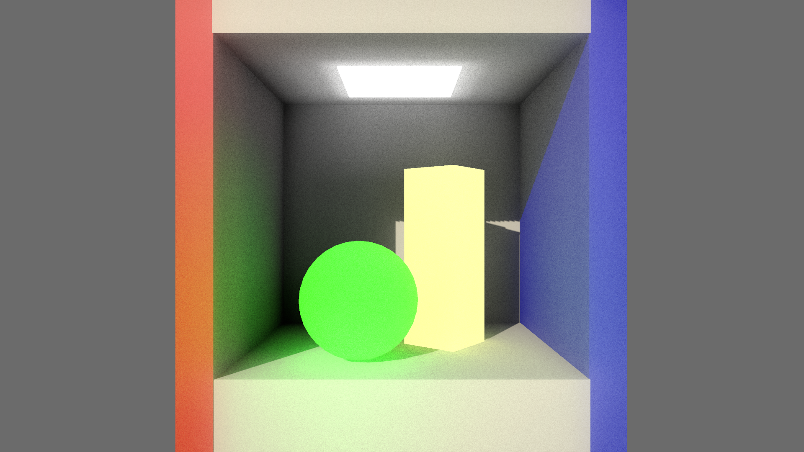
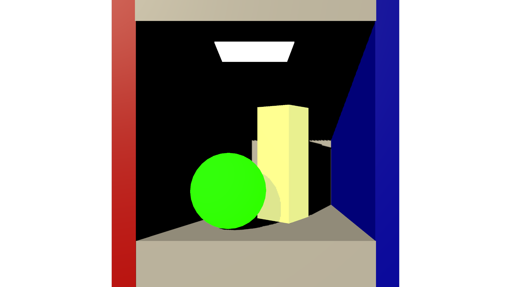
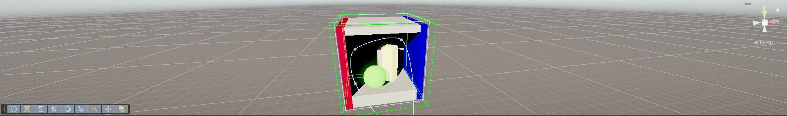
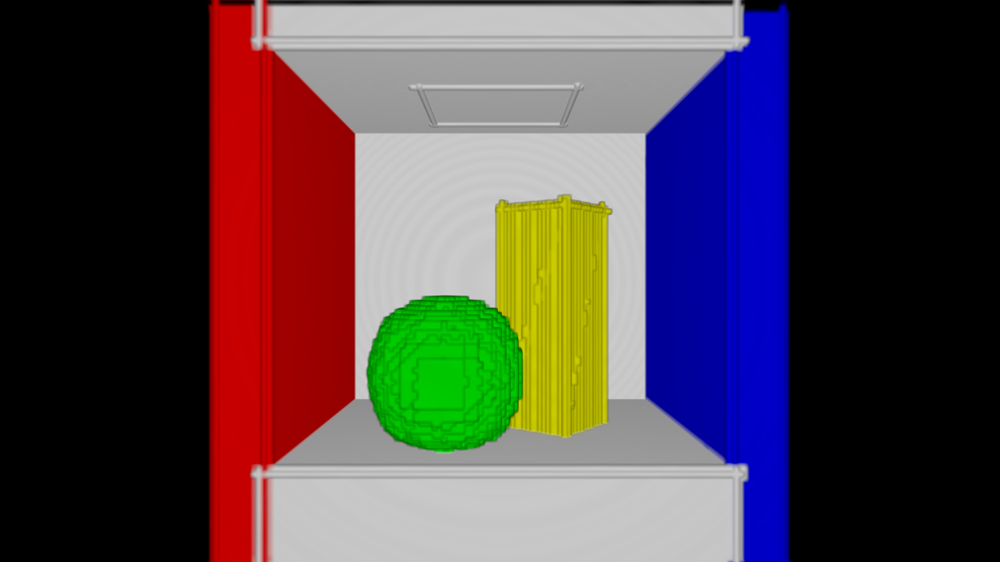
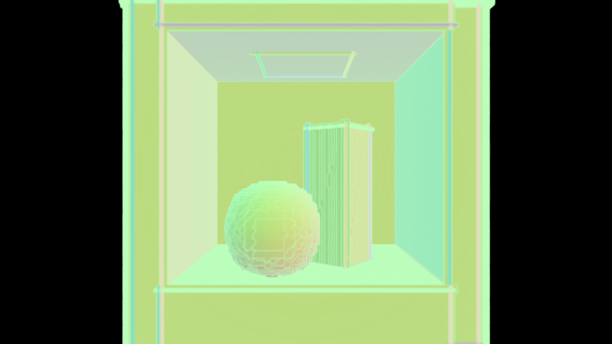
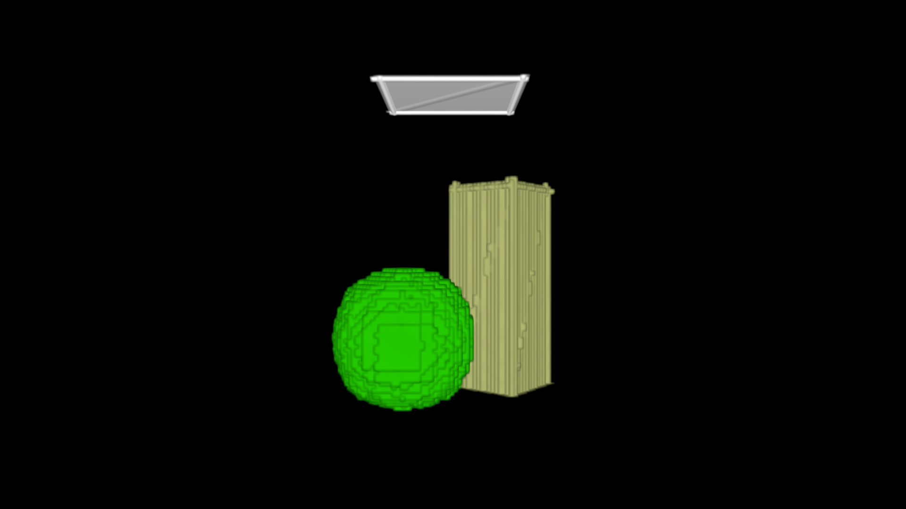
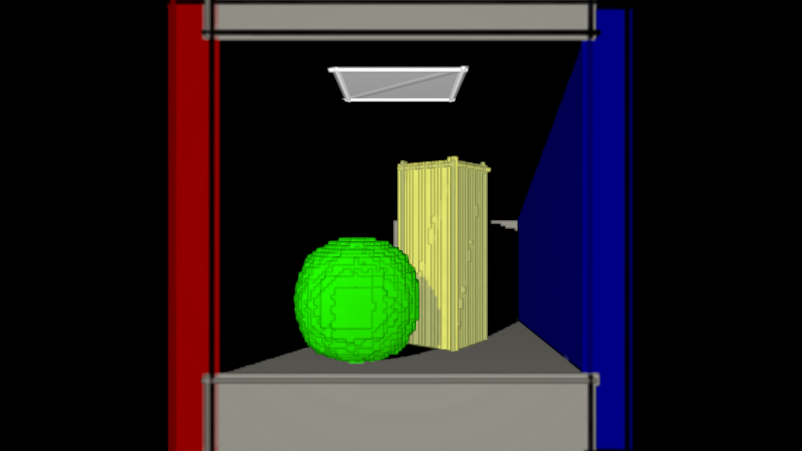
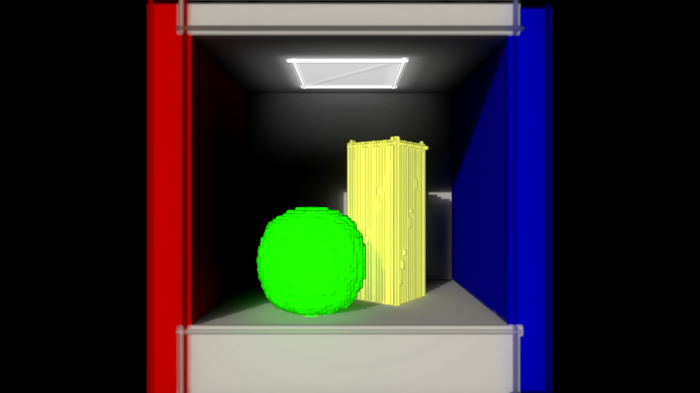
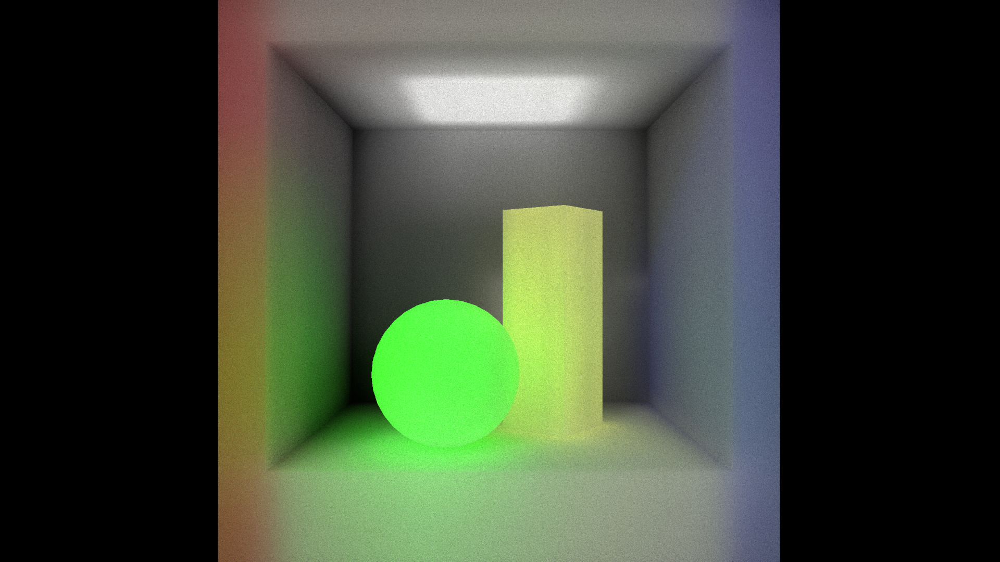

# QSTX VoxelGI

QSTX VoxelGI 是面向 Unity 6.3 / URP 17 的实时体素全局光照插件。它把场景几何和光照写入体素 Radiance，再将间接光投影回屏幕，为室内场景、发光材质和颜色溢出提供实时 GI 效果。



## 效果对比

相同相机、相同主光源下，关闭 VoxelGI 时场景主要依赖直接光照；开启后，墙面、地面和物体之间会出现间接照明、颜色反弹和发光传播。

| VoxelGI 关闭 | VoxelGI 开启 |
|---|---|
|  |  |

开启后可以观察到：

- 绿色球体的光照向地面和周围墙面传播。
- 黄色几何体受到环境间接光影响，暗部不再完全失去层次。
- 方向光之外的空间区域获得连续的间接照明。
- Temporal 与 Bilateral 阶段逐帧降低单帧 Cone Tracing 带来的噪声。

文档中的效果图使用固定相机、固定方向光和偏向展示质量的临时运行时配置，用于突出 GI 的视觉贡献；实际项目中的亮度、Cone 质量和降噪速度由 Volume Profile 控制。

## 核心功能

### 实时体素全局光照

VoxelGI 使用世界空间体素网格保存场景表面、法线、发光和辐射信息。体素数据可以随场景更新，在不依赖离线 Lightmap 的情况下提供动态间接光。

### 方向光、发光与二次反弹

方向光会写入体素 Radiance，Emissive 材质也可以参与光照传播。开启二次反弹后，间接光会再次经过体素 Cone Tracing，使颜色溢出和室内反射更明显。

### 屏幕空间 Cone Tracing

屏幕表面通过深度和法线重建世界位置，再从体素 Radiance 中沿半球方向发射 Cone。Cone 数量、步进、角度和 Mip 级别共同影响画面质量与性能。

### Temporal 与 Bilateral 降噪

Temporal 使用 Motion Vector 和跨帧 History 累积不同帧的低样本结果；Bilateral 使用深度与法线相似度进行边缘保持滤波。两者结合后，可以在较低 Cone 数量下获得更平滑的间接光。

### Local Volume 与独立 Voxel Bounds

VoxelGI Volume 控制相机进入哪些区域时启用 GI；独立的 Voxelization Bounds 控制体素网格覆盖范围。两者分离后，可以用较小的局部 Volume 控制效果范围，同时用更大的 Bounds 覆盖需要参与 GI 的几何体。



### 更新策略

- `EveryFrame`：适合持续变化的动态场景。
- `OnChange`：检测场景对象、材质、Bounds 和相关设置变化后更新。
- `Manual`：由代码显式请求体素化更新，适合稳定场景或自定义更新时机。

### URP 材质兼容与 Blocker

普通表面继续使用 URP/Lit 等标准材质，VoxelGI 不需要替换整个材质系统。VoxelGI Blocker 可以让不可见对象阻挡方向光和体素辐射，但不作为可见 GI 表面参与合成。

## 渲染 Pass

VoxelGI 的运行流程可以概括为：

```text
Shadow → Voxelization → Lighting → ScreenTrace
                                  ↓
                         Temporal → Bilateral
                                  ↓
                              Composite
```

| Pass | 作用 | 产生的效果 |
|---|---|---|
| `Shadow` | 生成方向光使用的体素阴影深度 | 让体素光照受到主光源遮挡影响 |
| `Voxelization` | 写入 Albedo、Normal、Emissive 与 Opacity 体素数据 | 建立可用于 GI 采样的场景体积表示 |
| `Lighting` | 计算 Direct Radiance，可选计算二次反弹并生成 Mip | 生成不同尺度的体素辐射数据 |
| `ScreenTrace` | 从屏幕表面向体素 Radiance 发射 Cone | 把体素 GI 投影到当前画面 |
| `Temporal` | 使用 Motion Vector 和 History 做跨帧累积 | 降低单帧低样本带来的噪声 |
| `Bilateral` | 按深度和法线进行边缘保持滤波 | 减少跨表面串色并平滑空间噪声 |
| `Composite` | 将间接光叠加回 URP Camera Color | 形成最终场景画面 |
| `Debug` | 显示各阶段的中间结果 | 便于观察体素和屏幕空间数据 |

## 调试视图

VoxelGI 提供多个中间结果视图，用于区分几何、光照、采样和降噪阶段的问题。

| Albedo | Normal |
|---|---|
|  |  |

| Emissive | Direct Radiance |
|---|---|
|  |  |

| Final Radiance | Screen Trace |
|---|---|
|  |  |

| Temporal | Bilateral |
|---|---|
|  |  |

这些视图的排查顺序通常是：先确认 Albedo/Normal，再确认 Direct/Final Radiance，最后对比 Screen Trace、Temporal 和 Bilateral，定位问题发生在体素数据、屏幕采样还是降噪阶段。

## 适用场景与定位

VoxelGI 适合用于：

- 动态室内场景和实时展示空间。
- 需要颜色溢出或 Emissive 间接光的场景。
- 不希望完全依赖离线 Lightmap 的交互式内容。
- 需要在运行时切换 GI 区域或更新场景几何的项目。

它是实时近似 GI 方案，效果会受到体素分辨率、Cone 数量、更新策略、Temporal 权重和 Bilateral 参数影响；对于离线烘焙质量、精确反射和透明材质，它不替代 Lightmap、Reflection Probe 或专用路径追踪方案。
